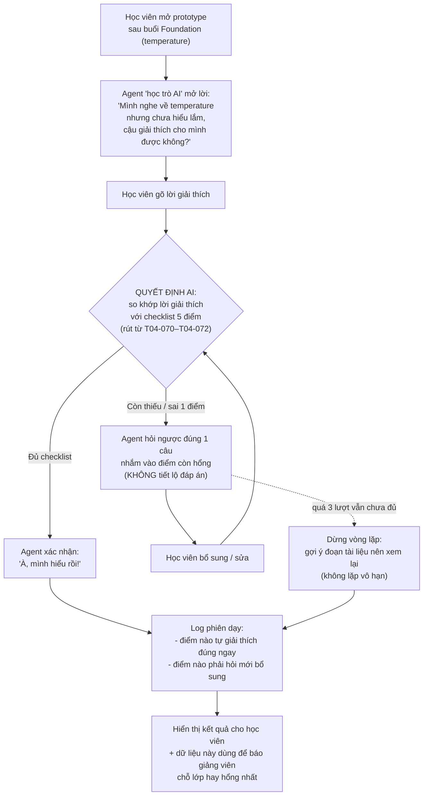

# Luồng hoạt động — CP2

Prototype: agent "học trò AI" để học viên dạy lại khái niệm **temperature & sampling** vừa học ở buổi Foundation Day 1. Lát cắt: một học viên · dạy lại một khái niệm · AI quyết định lời giải thích đã đủ đúng hay còn hổng (so khớp checklist) · kết quả là xác nhận "đã dạy được" + log.

## Sơ đồ luồng (Mermaid — render trực tiếp trên GitHub)

## Các bước (dạng chữ, phòng khi Mermaid không hiển thị)

1. **Học viên mở prototype** sau khi học xong buổi Foundation (khái niệm: temperature & sampling).
2. **Agent "học trò AI" mở lời** — đóng vai người chưa hiểu, xin học viên giải thích lại.
3. **Học viên gõ lời giải thích** bằng lời của mình.
4. **Quyết định AI (lời gọi AI chạy thật):** so khớp lời giải thích với checklist 5 điểm bắt buộc (định nghĩa · thấp→ổn định · cao→đa dạng · khi nào dùng cái nào · khác top-k/top-p), rút từ transcript `[T04-070]`–`[T04-072]`.
5. **Rẽ nhánh:**
   - **Đủ checklist** → agent xác nhận đã hiểu, kết thúc phiên "đã dạy được".
   - **Còn thiếu/sai** → agent hỏi ngược đúng 1 câu nhắm vào điểm còn hổng, **không tiết lộ đáp án** → học viên bổ sung → quay lại bước 4.
6. **Chặn vòng lặp vô hạn:** quá 3 lượt hỏi ngược vẫn chưa đủ → dừng, gợi ý đoạn tài liệu học viên nên xem lại thay vì hỏi mãi.
7. **Log phiên dạy:** ghi lại điểm nào học viên tự giải thích đúng ngay, điểm nào phải được hỏi mới bổ sung — hiển thị cho học viên, và là dữ liệu để báo giảng viên biết lớp đang hổng chỗ nào nhiều nhất.

## Đối chiếu với ràng buộc của đề

- **1 quyết định AI duy nhất** (bước 4) — đúng format lát cắt một câu.
- **An toàn (theo yêu cầu track D3):** agent không lộ đáp án khi đóng vai học trò (bước 5); không để vòng lặp hỏi ngược vô hạn gây khó chịu (bước 6); nói rõ đây là luyện tập, không phải chấm điểm.
- **Bước cần AI call thật** cho CP3 (video thao tác): bước 4 — chính là chỗ bắt buộc phải có ≥1 lời gọi AI chạy thật theo luật chung.
